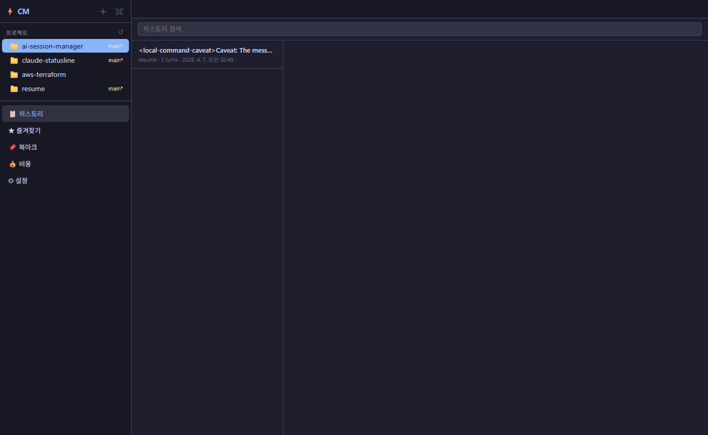
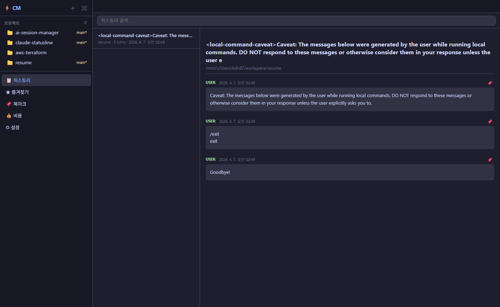
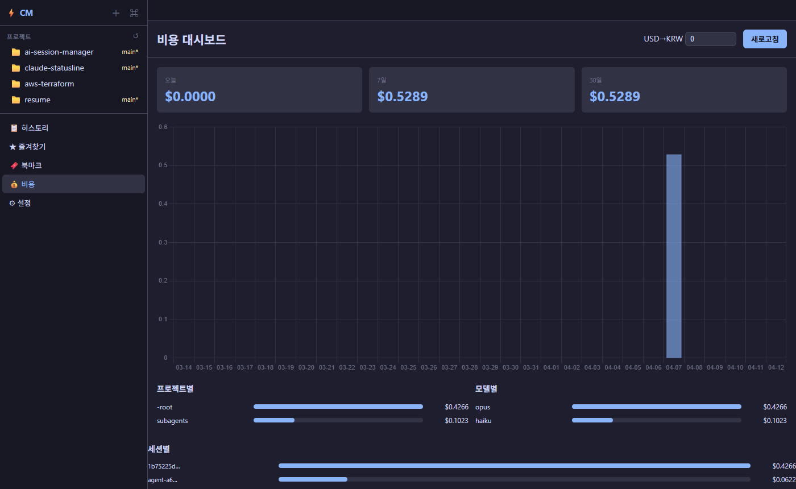
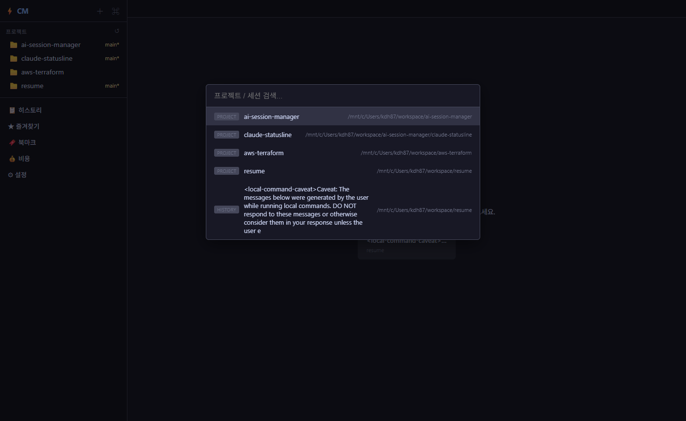

# AI Session Manager

Claude CLI 세션을 브라우저에서 관리하는 웹 대시보드.  
tmux + xterm.js 기반으로 터미널, 히스토리 뷰어, 비용 분석 등을 제공합니다.

---

## 스크린샷

| 대시보드 & 프로젝트 | 히스토리 뷰어 |
|---|---|
|  |  |

| 비용 대시보드 | Command Palette (`Ctrl+K`) |
|---|---|
|  |  |

---

## 주요 기능

- **웹 터미널** — xterm.js로 tmux 세션에 접속, 검색/리사이즈/멀티탭
- **세션 관리** — 생성/종료/재시작/이어하기, 서버 재시작해도 tmux 세션 유지
- **히스토리 뷰어** — JSONL 파싱, 마크다운 렌더링, 토큰 통계, thinking 블록 토글
- **비용 대시보드** — 일별/프로젝트별/모델별 비용 분석 (Chart.js)
- **즐겨찾기/북마크** — 세션 즐겨찾기, 대화 turn 북마크 + 태그/댓글
- **알림(SSE)** — Claude 작업 완료 시 브라우저 알림
- **Command Palette** — `Ctrl+K`로 프로젝트/세션 빠른 검색

---

## 요구사항

| 항목 | 버전 |
|------|------|
| Python | 3.10+ |
| tmux | 3.0+ |
| Claude CLI | 최신 (`npm i -g @anthropic-ai/claude-code`) |
| Node.js | 18+ (Claude CLI 설치용) |

---

## Windows 설치 (WSL)

### 1. WSL 설치

PowerShell(관리자 권한)에서:

```powershell
# WSL 활성화 및 기본 배포판 설치
wsl --install

# 또는 특정 배포판 설치
wsl --install -d Ubuntu-24.04
```

> Rocky Linux를 쓰려면 Microsoft Store에서 "Rocky Linux" 검색하여 설치하세요.

설치 후 재부팅 → WSL 터미널에서 사용자/비밀번호 설정.

### 2. WSL 안에서 설정

```bash
# (Rocky/RHEL 계열)
sudo dnf install -y git tmux python3 python3-pip nodejs npm

# (Ubuntu/Debian 계열)
sudo apt update && sudo apt install -y git tmux python3 python3-pip nodejs npm
```

### 3. Claude CLI 설치

```bash
npm install -g @anthropic-ai/claude-code
```

설치 확인:

```bash
claude --version
```

### 4. 프로젝트 클론 및 실행

```bash
git clone git@github.com:kdh8733/ai-session-manager.git
cd ai-session-manager
./run.sh
```

> `run.sh`가 tmux, python3, pip가 없으면 자동 설치합니다.

### 5. 브라우저 접속

Windows 브라우저에서:

```
http://localhost:5000
```

> WSL의 `0.0.0.0:5000`은 Windows `localhost:5000`으로 자동 포워딩됩니다.

---

## macOS 설치

### 1. Homebrew로 의존성 설치

```bash
# Homebrew 없으면 먼저 설치
/bin/bash -c "$(curl -fsSL https://raw.githubusercontent.com/Homebrew/install/HEAD/install.sh)"

# 필수 패키지
brew install tmux python3 node
```

### 2. Claude CLI 설치

```bash
npm install -g @anthropic-ai/claude-code
```

설치 확인:

```bash
claude --version
```

### 3. 프로젝트 클론 및 실행

```bash
git clone git@github.com:kdh8733/ai-session-manager.git
cd ai-session-manager
./run.sh
```

### 4. 브라우저 접속

```
http://localhost:5000
```

---

## 초기 설정

처음 접속하면 설정 화면이 나옵니다:

1. **Project Directories** — Claude로 작업하는 프로젝트 경로 추가 (예: `/home/user/workspace`)
2. **Claude Binary** — Claude CLI 경로 (보통 `claude` 그대로 두면 됨)
3. **Claude Directory** — `~/.claude` (기본값)

설정 파일은 `~/.config/claude-manager/config.json`에 저장됩니다.

---

## 사용법

### 세션 생성

사이드바에서 프로젝트 선택 → **+ 버튼** → 새 Claude 세션이 tmux에서 생성되고 웹 터미널에 표시됩니다.

### 히스토리 보기

사이드바에서 프로젝트의 과거 세션 클릭 → JSONL 기반 대화 내역을 마크다운으로 렌더링.

### 비용 대시보드

사이드바의 **Cost Dashboard** → 오늘/7일/30일 비용 개요, 일별/프로젝트별/모델별 차트.

### 알림 설정 (선택)

Claude CLI의 hook으로 `cm-notify.sh`를 등록하면 작업 완료 시 브라우저 알림을 받을 수 있습니다:

```bash
# cm-notify.sh를 Claude hook 디렉토리에 복사
cp scripts/cm-notify.sh ~/.config/claude-manager/
chmod +x ~/.config/claude-manager/cm-notify.sh
```

---

## 환경변수

| 변수 | 기본값 | 설명 |
|------|--------|------|
| `CM_HOST` | `0.0.0.0` | 서버 바인드 주소 |
| `CM_PORT` | `5000` | 서버 포트 |
| `CM_PROJECT_DIRS` | — | 프로젝트 디렉토리 (쉼표 구분) |
| `CM_CLAUDE_BIN` | `claude` | Claude CLI 경로 |
| `CM_CLAUDE_DIR` | `~/.claude` | Claude 데이터 디렉토리 |
| `CM_CONFIG_DIR` | `~/.config/claude-manager` | 설정 디렉토리 |

예시:

```bash
CM_PORT=8080 CM_PROJECT_DIRS="/home/user/project-a,/home/user/project-b" ./run.sh
```

---

## 백그라운드 실행

```bash
# tmux 안에서 서버 실행 (서버 자체도 tmux 세션으로)
tmux new-session -d -s cm-server './run.sh'

# 로그 확인
tmux attach -t cm-server

# 종료
tmux kill-session -t cm-server
```

---

## 문제 해결

### WSL에서 localhost 접속 안 될 때

```powershell
# PowerShell(관리자)에서 포트 포워딩
netsh interface portproxy add v4tov4 listenport=5000 listenaddress=0.0.0.0 connectport=5000 connectaddress=$(wsl hostname -I | ForEach-Object { $_.Trim() })
```

### tmux 세션이 남아있을 때

```bash
# 모든 cm-* 세션 확인
tmux list-sessions | grep ^cm-

# 특정 세션 종료
tmux kill-session -t cm-project-1

# 모든 cm-* 세션 종료
tmux list-sessions -F '#{session_name}' | grep ^cm- | xargs -I{} tmux kill-session -t {}
```

### Claude CLI를 못 찾을 때

```bash
# 경로 확인
which claude

# 없으면 재설치
npm install -g @anthropic-ai/claude-code

# 또는 환경변수로 직접 지정
CM_CLAUDE_BIN=/home/user/.npm-global/bin/claude ./run.sh
```

---

## 라이선스

MIT
